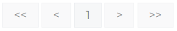

# Stylish
[](https://github.com/fremantle-industries/stylish/actions?query=workflow%3Atest)
[](https://hex.pm/packages/stylish)

Phoenix view helpers for HTML components styled with tailwindcss

## Installation

Add the `stylish` package to your list of dependencies in `mix.exs`:

```elixir
def deps do
  [
    {:stylish, "~> 0.0.3"}
  ]
end
```

## Tables

### Navigation

Navigation links between the first, previous, current, next & last page of a table



```elixir
<%= render(
  Stylish.Table,
  "navigation.html",
  conn: @conn,
  to: fn endpoint, page -> endpoint.example_path(endpoint, :index, page: page) end,
  current_page: 5,
  last_page: 10
) %>

```

## Authors

- Alex Kwiatkowski - alex+git@fremantle.io

## License

`stylish` is released under the [MIT license](./LICENSE)
